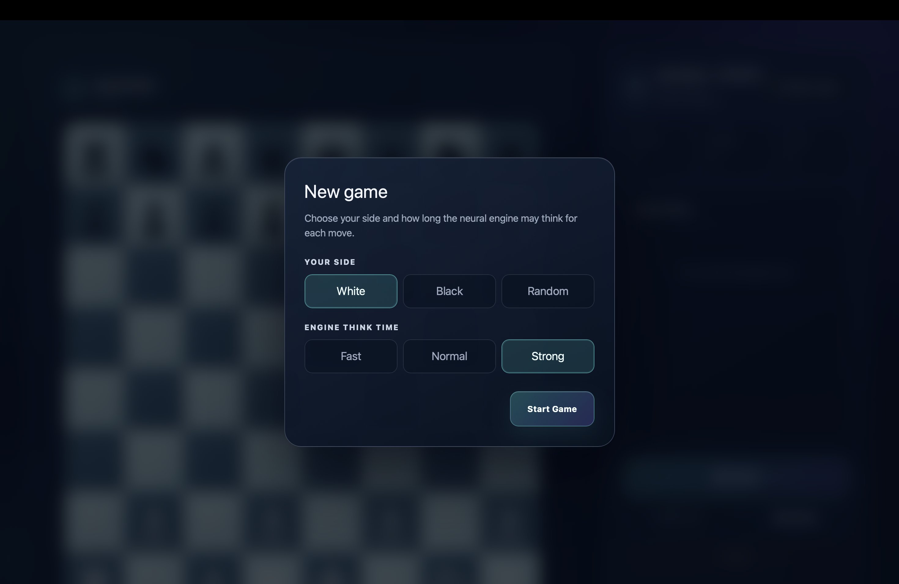
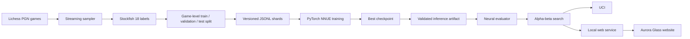

# Neural Chess Engine

<div align="center">

**A CPU-first neural chess engine with an NNUE-style evaluator, alpha-beta search, UCI support,
and a local Aurora Glass website.**


</div>

This project grew from a small handcrafted Python chess game into a reproducible neural engine.
It learns position values from Stockfish labels, searches legal moves with iterative-deepening
negamax, and plays on an ordinary laptop without a GPU.

> [!IMPORTANT]
> The engine is **not Elo-rated yet**. Its measured results establish improvement over this
> repository's imported baseline, not a rating against a calibrated chess pool.

## How to run

Open Terminal and paste:

```bash
cd /Users/deepakgupta/Desktop/chess-engine/chess_engine_nn
python3 -m pip install -e ".[web]"
python3 -m chess_engine_nn.web_api \
  --model artifacts/models/phase7-full-2013-01.pt
```

The website should open automatically. If it does not, visit <http://127.0.0.1:8765>.

- Keep the Terminal window running while playing.
- Press `Control-C` to stop the website.
- The model must exist at `artifacts/models/phase7-full-2013-01.pt`.
- Gameplay requires no GPU, Stockfish, training dataset, or Pygame.

## Interface preview

The Phase 8 interface is a responsive, local-first React application with a glassmorphism visual
system, click/drag moves, promotion, captured-piece material tracking, move history, search
statistics, board flipping, full-turn undo, resignation, and game-over review.

<p align="center">
  
</p>

<p align="center"><em>Active game with legal-move indicators, search statistics, and scrollable
move history.</em></p>

<table>
  <tr>
    <td width="50%" align="center">
      
      <br><sub><strong>New game:</strong> choose White, Black, or Random and the engine think time.</sub>
    </td>
    <td width="50%" align="center">
      
      <br><sub><strong>Material tracking:</strong> captured pieces and the leading side's point advantage.</sub>
    </td>
  </tr>
  <tr>
    <td width="50%" align="center">
      
      <br><sub><strong>Player victory:</strong> centered result dialog with board review and rematch.</sub>
    </td>
    <td width="50%" align="center">
      
      <br><sub><strong>Engine victory:</strong> complete move history, captured pieces, and material score.</sub>
    </td>
  </tr>
</table>

## Engine scorecard

| Area | Rating | Evidence |
|---|---:|---|
| Rules and legality | 9/10 | `python-chess` authority, maintained terminal/tactical tests, no candidate illegal moves in the locked match |
| Neural evaluation | 7.5/10 | 86.407% held-out sign accuracy and 67.159% outcome accuracy |
| Search and runtime | 7.5/10 | Iterative deepening, alpha-beta, quiescence, transposition table, time controls, and cooperative cancellation |
| Reproducibility | 9/10 | Frozen seeds, game-level splits, manifests, checksums, reports, and isolated wheel verification |
| Product experience | 8/10 | UCI plus packaged local web UI; interactive cross-device QA remains |
| **Overall project rating** | **8/10** | Strong experimental CPU engine with a complete pipeline; not yet a calibrated competitive engine |

**Chess rating: Unrated.** Establishing Elo requires balanced games against multiple calibrated
opponents under a fixed time control. The current benchmark is **162.5/208 (78.125%)** against the
imported depth-2 engine. Removing every legacy illegal-move forfeit gives the conservative
sensitivity result **58.5/104 (56.25%)**. Neither result is an Elo measurement.

## What is inside

- A `781 -> 256 -> 32 -> 1` NNUE-style scalar evaluator trained in PyTorch.
- Side-to-move-relative piece-square, castling, turn, and legal en-passant features.
- Iterative-deepening negamax with alpha-beta pruning and quiescence search.
- Move ordering, a bounded transposition table, time/node/depth limits, and cancellation.
- A clean UCI process for chess GUIs and automated matches.
- A local FastAPI REST/WebSocket game service.
- A responsive React/TypeScript Aurora Glass playing interface.
- Streaming PGN ingestion, Stockfish labeling, deterministic splits, training, export, metrics,
  and controlled-match tooling.

## Pipeline



Training and gameplay are separate. The runtime loads only the frozen inference artifact; it
does not initialize datasets, optimizers, Stockfish, or training checkpoints.

## Training snapshot

The v1 model was trained from the Lichess January 2013 standard-rated database. Stockfish 18
labeled sampled positions at depth 8.

| Item | Result |
|---|---:|
| Source games read | 121,332 |
| Training positions | 1,557,221 |
| Validation positions | 86,213 |
| Test positions | 86,452 |
| Duplicate positions removed | 109,549 |
| Best checkpoint | Epoch 5 |
| Training stopped | Epoch 10 |
| Frozen test sign accuracy | 86.4071% |
| Frozen test outcome accuracy | 67.1593% |

The neural evaluator improved validation sign accuracy from the material baseline's **71.3472%**
to **86.7405%**. See the [Phase 7 report](.md/Phase7.md) for the full corpus provenance, metrics,
error buckets, and match caveats.

## Website features

The local website supports:

- White, Black, or Random side selection;
- 250 ms, 1 second, or 3 second engine think time;
- click-to-move and drag-to-move;
- legal destinations, previous move, check, promotion, and game-over states;
- captured pieces and material advantage;
- scrollable SAN move history and live search statistics;
- New Game, Undo Turn, Flip Board, and Resign.

## Use with a chess GUI

Install the package and point a UCI-compatible GUI at the console entry point:

```bash
cd /Users/deepakgupta/Desktop/chess-engine/chess_engine_nn
python3 -m pip install -e .
chess-engine-nn-uci --model artifacts/models/phase7-full-2013-01.pt
```

Supported UCI commands include `uci`, `isready`, `ucinewgame`, `position`, `go`, `stop`,
`setoption`, and `quit`. Search accepts depth, nodes, move time, clocks, increments, and
moves-to-go limits. V1 search is intentionally single-threaded.

## Build the model yourself

Run commands from the nested installable project so the outer legacy package does not shadow it:

```bash
cd /Users/deepakgupta/Desktop/chess-engine/chess_engine_nn
python3.11 -m venv .venv
source .venv/bin/activate
python -m pip install -e ".[training,dev,web]"
```

Then run the pipeline:

```bash
# 1. Validate the environment
python -m chess_engine_nn.cli --config configs/dev.toml doctor

# 2. Sample PGNs and create Stockfish-labeled, split dataset shards
python -m chess_engine_nn.cli --config configs/train.toml generate-data \
  --pgn data/raw/games.pgn \
  --output data/processed/my-run

# 3. Train and select the best validation checkpoint
python -m chess_engine_nn.cli --config configs/train.toml train \
  --dataset data/processed/my-run \
  --output artifacts/checkpoints/my-run

# 4. Evaluate before freezing
python -m chess_engine_nn.cli --config configs/train.toml evaluate-model \
  --checkpoint artifacts/checkpoints/my-run/best.pt

# 5. Export the inference-only artifact
python -m chess_engine_nn.cli export \
  --checkpoint artifacts/checkpoints/my-run/best.pt \
  --output artifacts/models/my-engine.pt

# 6. Search or launch UCI
python -m chess_engine_nn.cli search --model artifacts/models/my-engine.pt --depth 3
python -m chess_engine_nn.uci --model artifacts/models/my-engine.pt
```

Stockfish is required only for offline label generation and controlled benchmarking. Gameplay
does not require Stockfish, a GPU, the dataset, optimizer state, or Pygame.

## Architecture

```text
Browser UI ── REST/WebSocket ──> authoritative python-chess game service
                                      │
UCI / CLI ────────────────────────────┼──> iterative alpha-beta search
                                      │              │
                                      │              └──> frozen neural evaluator
                                      │
                                      └──> legal moves, outcomes, SAN, captured material

PGN ──> sampler ──> Stockfish labels ──> shards ──> trainer ──> exporter ──> model.pt
```

`python-chess` is the sole rules authority. The neural model evaluates positions; it does not
generate moves or decide legality. The web client renders server state and cannot apply a move
that the backend rejects. Searches run in a background worker, and generation IDs prevent stale
results from changing a restarted or undone game.

## Repository layout

```text
chess-engine/
├── chess_engine_nn/                 # installable project
│   ├── chess_engine_nn/
│   │   ├── data/                    # PGN, labels, records, deterministic splits
│   │   ├── training/                # dataset, trainer, metrics, export
│   │   ├── web_api/                 # game service, REST/WebSocket API, packaged UI
│   │   ├── encoding.py              # sparse feature schema
│   │   ├── evaluator.py             # material and neural evaluators
│   │   ├── search.py                # iterative neural search
│   │   └── uci.py                   # UCI adapter and search worker
│   ├── web/                         # React/TypeScript interface source
│   ├── configs/                     # development, training, benchmark, release configs
│   ├── tests/                       # unit, integration, tactical, UCI, and web tests
│   └── tools/                       # profiling and controlled-match utilities
├── .md/                             # requirements, design, phase reports, project memory
└── board.py, game.py, ...           # preserved imported baseline
```

The imported top-level engine remains a benchmark only. The new engine does not depend on its
custom board, handcrafted evaluator, Pygame loop, or piece assets.

## Verification and release evidence

- **102 tests passing** across encoding, data, training, artifacts, search, tactics, timing, UCI,
  cancellation, web game state, REST, and WebSocket behavior.
- Ruff, frontend lint, frontend builds, wheel, and source distribution pass.
- The packaged wheel contains the compiled website and `chess-engine-nn-web` entry point.
- A clean wheel installation loaded the real model, served the website, and completed `e4 e5`.
- The 208-game candidate made no illegal moves.

Frozen model:

```text
artifacts/models/phase7-full-2013-01.pt
SHA-256: 7f0514f09bd1e84091e7fbf852412b6f86b80c41d240a9c7b5db166a031a8387
```

The model is intentionally ignored by Git and must be retained or distributed separately.

## Current limitations

- No calibrated Elo rating yet.
- Search is single-threaded and performs PyTorch inference at searched leaves.
- No opening book, endgame tablebases, policy network, MCTS, or self-play.
- The web service is local-first and binds to loopback by default; public hosting is not included.
- Large-evaluation-error positions remain the weakest held-out bucket.
- Interactive browser/device QA is the remaining Phase 8 closure item.

## Documentation

- [Product requirements](.md/prd.md)
- [Architecture](.md/architechture.md)
- [Product design](.md/Design.md)
- [Delivery phases](.md/phases.md)
- [Project memory](.md/Memory.md)
- [Imported baseline](.md/Baseline.md)
- [Phase 6 performance report](.md/Phase6.md)
- [Phase 7 model and release report](.md/Phase7.md)
- [Phase 8 website plan and status](.md/Phase8.md)
- [Package specification](chess_engine_nn/README.md)

## License

No repository license has been selected yet. Add a license before redistributing the source,
model artifact, or packaged application.
